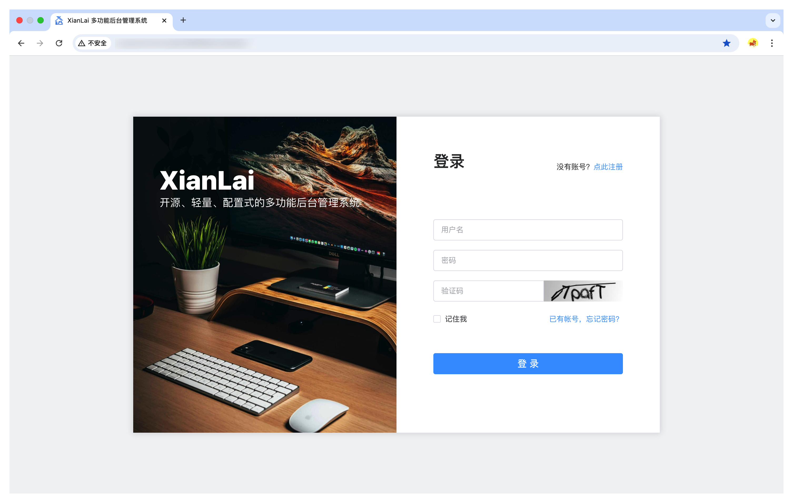
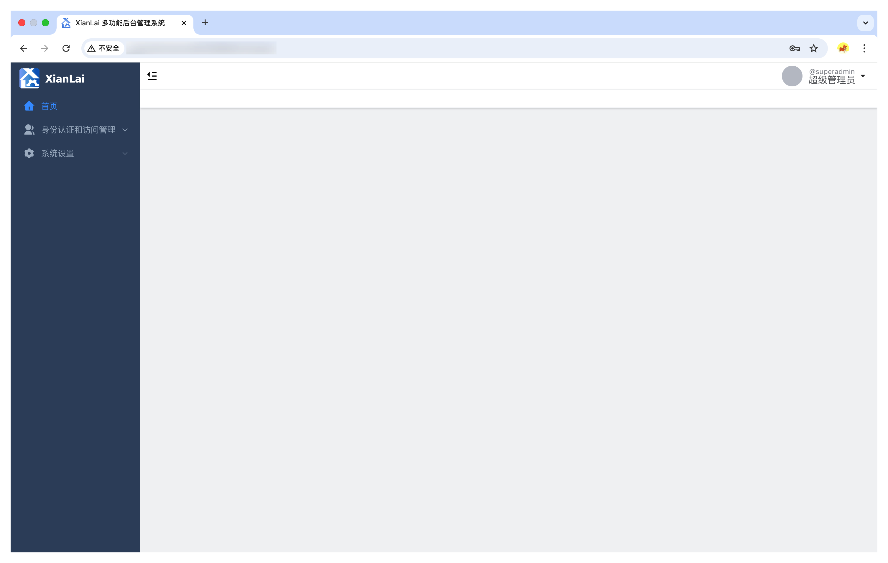
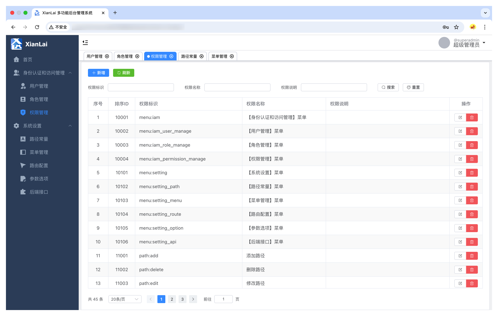
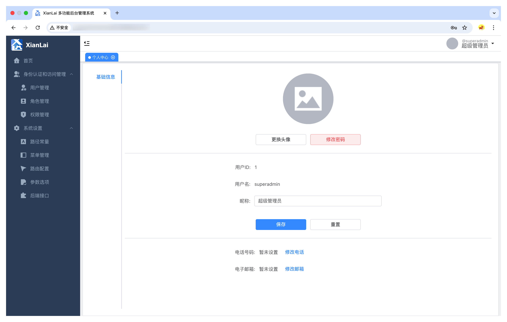

# XianLai-Vue

`v0.2.0`

坚持不容易，请给作者点点 ⭐️Star⭐️ 鼓励鼓励。

## 简介

XianLai 是一款基于 Vue3 + ElementPlus 和 Spring Cloud Alibaba 的开源、轻量的多功能后台管理系统。它采用分布式微服务架构，支持配置化 UI 页面、身份识别和访问管理（IAM），同时也提供了工作生活中很多很有用的功能板块，能够帮助你提高工作效率、理顺家庭生活。

你可以按照本文档说明部署 XianLai 系统后直接使用它提供的功能。当然你也可以基于 XianLai 系统的配置化 UI 页面、身份识别和访问管理（IAM）等基础功能，快速搭建你自己的后台管理系统，开发你想要的个性化功能。

本仓库是前端部分，后端请去往：[https://github.com/Wyatt6/xianlai](https://github.com/Wyatt6/xianlai)

## 招贤榜

一个人的力量是有限的，团体的力量是无穷的。我们还有很多有趣的、可能对大家有帮助的想法有待实现。欢迎各位对本项目感兴趣的开发者参与进来，共同参与产品研发和项目建设，同时交流探讨技术一起进步。由于我们稍微有点完美主义，在用户体验和代码质量上的要求较高，请多担待。志同道合者请联系：wyatt6@163.com。

## 系统功能清单

- **配置化**：自定义门户封面图片、标题、副标题、版权说明、备案号；开放注册、用户名密码格式、登录令牌有效期；验证码长度和有效期；
- **基础功能**：用户注册、用户登录、退出登录、个人中心、更换头像、修改密码、修改个人信息；
- **系统设置**：路径常量、菜单管理、路由配置、参数选项、后端接口；
- **身份识别和访问管理**：基于RBAC原理和Sa-Token框架实现，包含用户管理、角色管理、权限管理；
- **多功能工具箱**：密码本。

## 前端技术栈

`Vue.js 3.5.12`，`Element Plus 2.9.0`，`Vite 5.4.10`，`Vue Router 4.4.5`，`Pina 2.2.4`，`Sass 1.80.6`，`sass-loader 16.0.3`，`ESLint 9.13.0`，`Prettier 3.3.3`，`Axios 1.7.7`，`vite-awesome-svg-loader 1.3.5`，`Nginx 1.27.2`等。

## 部署手册

基于 Nginx 进行部署。

### 1. 拉取 Nginx 镜像

```shell
docker pull nginx:1.27.2
```

### 2. 创建目录和配置文件

在服务器上为 Nginx 的部署创建如下结构的目录和配置文件：

```
+ nginx/
|       nginx.conf                  Nginx 配置文件
|       + html/
|       |       + xianlai-vue/      存放打包程序的目录
|       + ssl_cert/                 存放SSL证书的目录
|       + log/                      存放 Nginx 运行日志的目录
```

### 3. 编辑 Nginx 配置文件

#### 使用 IP 的 HTTP 访问配置

```shell
error_log  /var/log/nginx/error.log  notice;
pid        /var/run/nginx.pid;
events {
    worker_connections  1024;
}
http {
    access_log    /var/log/nginx/access.log;
    include       /etc/nginx/mime.types;
    default_type  application/octet-stream;

    server {
        listen  80;

        location / {
            root /usr/share/nginx/html/xianlai-vue/dist;
            index index.html;
            try_files $uri $uri/ /index.html;
        }

        location /api {
            proxy_pass  http://xianlai-app-gateway:30000/api;
        }
    }
}
```

#### 使用域名的 HTTPS 访问配置

（待补充）

### 4. 构建前端程序包并上传

在工程根目录下执行`npm run build`命令构建程序包，会在工程根目录生成一个`dist/`文件夹，将其上传到上述的`nginx/html/xianlai-vue/`目录下。

### 5. 启动 Nginx 容器

启动 Nginx 容器前请先确保 XianLai 后端已完成部署并正常运行，请见：[XianLai 后端部署手册](https://github.com/Wyatt6/xianlai?tab=readme-ov-file#%E9%83%A8%E7%BD%B2%E6%89%8B%E5%86%8C)。进入上面第1步所说的`nginx/`目录下，执行以下命令启动 Nginx 容器，注意`端口A`和`端口B`设置成希望服务器对外暴露的端口号：

```shell
docker run -d --name nginx \
    -v ./nginx/nginx.conf:/etc/nginx/nginx.conf:rw \
    -v ./nginx/html:/usr/share/nginx/html:rw \
    -v ./nginx/ssl_cert:/etc/nginx/ssl_cert:rw \
    -v ./nginx/log:/var/log/nginx:rw \
    --net xianlai_net \
    -p 端口A:80 -p 端口B:443 \
    --restart=onfailure:5 \
    nginx:1.27.2
```

到这里就完成了 XianLai 前端页面基于 Nginx 的部署，打开浏览器输入地址和端口就能访问。超级管理员初始用户名和密码都是`superadmin`，请及时修改密码。

## 开发手册

### 工程开发常用命令

1. `npm install` - 本地安装工程
2. `npm run dev` - 本地开发态编译运行
3. `npm run format` - 格式化所有代码
4. `npm run lint` - 语法和编码规范校验
5. `npm run build` - 编译和构建

## 附录A：效果预览









